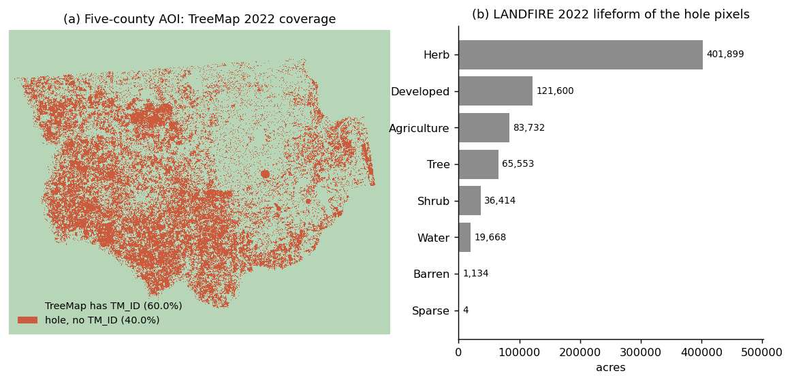
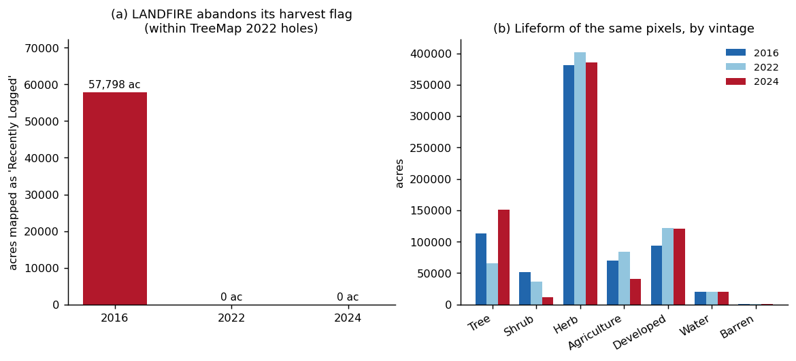
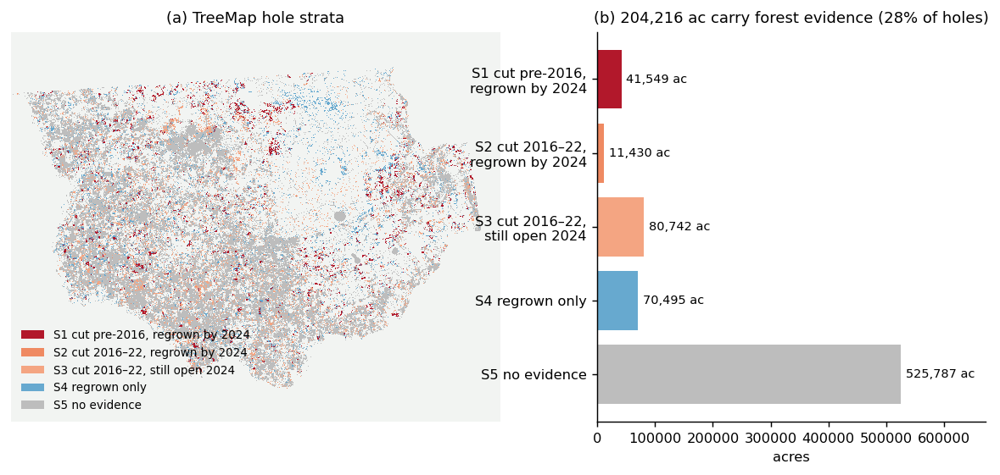
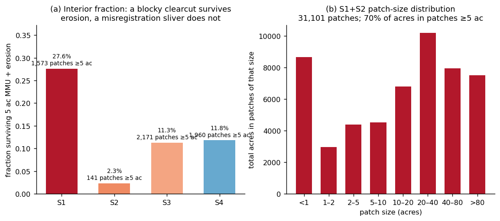
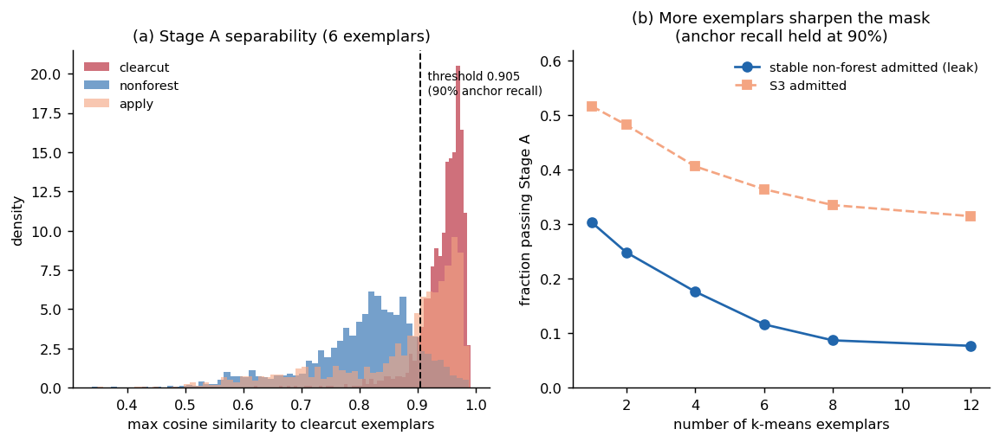
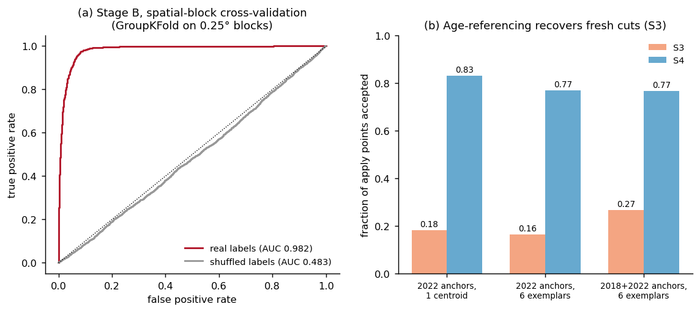
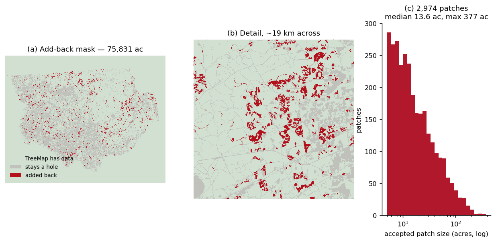
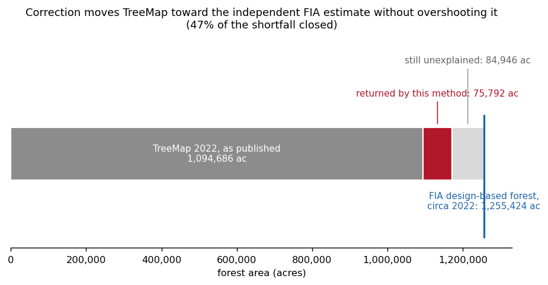
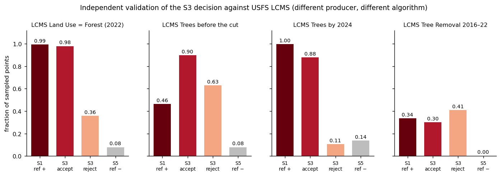
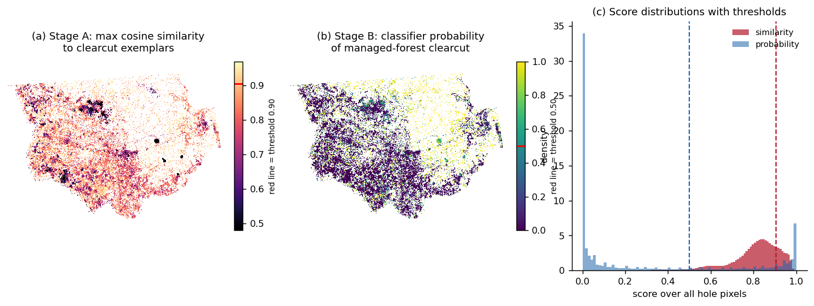

# Recovering clearcut managed forest omitted from TreeMap 2022

**A LANDFIRE-vintage stratification and AlphaEarth embedding classifier for the
five-county north-central Florida AOI**

Technical report · 2026-07-27 · ARTEMIS project
Analysis, figures and validation are reproducible from
`pipeline/s1_initial_state/` (see [Reproduction](#9-reproduction)).

---

## Abstract

TreeMap 2022 assigns an imputed FIA plot identifier (`TM_ID`) only where LANDFIRE
Existing Vegetation Type (EVT) classifies a pixel as forest. A stand harvested
shortly before the LANDFIRE vintage is mapped as ruderal grassland or pasture and
therefore becomes a *hole* in TreeMap, despite being managed forest land. In the
five-county AOI, **40.0 % of the land area (730,003 ac) is such a hole.**

We identify the mechanism, stratify the holes by forest evidence at the 2016 and
2024 LANDFIRE vintages, and build a two-stage AlphaEarth-embedding classifier
that decides which holes should be returned to TreeMap. We find that LANDFIRE
ceased populating its three `Recently Logged` classes after the 2016 vintage
(57,798 ac → 0 ac), removing the only explicit harvest marker; that 204,216 ac
(28 % of holes) carry forest evidence; and that a spatially-blocked classifier
separates managed-forest clearcut from stable non-forest at **AUC 0.982** against
a label-shuffle baseline of 0.483. The method returns **75,792 ac** to TreeMap in
2,975 patches of realistic harvest-unit size. Reconciliation against the FIA
design-based estimate for the same counties shows TreeMap under-maps forest by
160,738 ac; the correction closes **47 %** of that shortfall **without
overshooting**, indicating a conservative result.

The principal unvalidated quantity is the true positive rate within stratum S3
(recent cuts with no regrowth confirmation), where only 10 % of acreage was
accepted. Field or NAIP validation remains outstanding.

---

## 1. Problem and motivation

ARTEMIS initialises Forest Vegetation Simulator (FVS) runs from TreeMap, and
schedules harvest under an even-flow constraint. Both depend on the initial
inventory being complete. TreeMap's forest mask is inherited from LANDFIRE EVT,
so any stand that LANDFIRE does not call forest is invisible to the model.

This matters asymmetrically. The stands most likely to be misclassified are
*recently harvested plantations* — precisely the 0–8 year age cohort that
determines the next rotation's timber supply. Their omission does not merely
shrink the modelled land base; it removes the youngest cohort from the age
distribution, which biases any even-flow schedule built on it.

**Research question.** Which TreeMap 2022 holes are managed forest that was
clearcut near the vintage, and which are genuinely non-forest?

---

## 2. Data

All raster analysis is on the 30 m NAD83 / Conus Albers (EPSG:5070) grid.
AOI: Baker, Columbia, Hamilton, Suwannee and Union counties, Florida
(1210125–1342665 E, 831795–937605 N; 4418 × 3527 px).

| dataset | version / identifier | role | location |
|---|---|---|---|
| TreeMap 2022 CONUS | RDS-2025-0032, Houtman et al. 2025 | forest mask + `TM_ID` | `/mnt/d/TreeMap-2022/Data/` |
| TreeMap 2020 CONUS | RDS-2025-0031 | tested as a backfill source | `/mnt/d/TreeMap_Chaz/RDS-2025-0031/` |
| LANDFIRE EVT 2016 | LF 2.0.0 "2016 Remap" | forest evidence, t₀ | `/mnt/d/LF2016_EVT_CONUS/` |
| LANDFIRE EVT 2022 | Remap series | defines the holes | `/mnt/d/LF2022_EVT_CONUS/` |
| LANDFIRE EVT 2024 | Remap series | regrowth confirmation, t₁ | `/mnt/d/LF2024_EVT_CONUS/` |
| AlphaEarth annual embeddings | `GOOGLE/SATELLITE_EMBEDDING/V1/ANNUAL` | 64-band, 10 m, 2017–2024 | Earth Engine |
| FIADB (entire) | SQLite distribution | independent area validation | `/mnt/d/SQLite_FIADB_ENTIRE/` |

### 2.1 Legend consistency (a load-bearing check)

Cross-vintage EVT comparison is only valid if the class codes mean the same
thing. The local LF2016 download is **LF 2.0.0 ("2016 Remap")**, not the earlier
pre-Remap product: pasture/hayland is 7997, Southeastern Ruderal Grassland 9823
and Forest Plantation 9322 in **all three** vintages, with 1,046 class names
shared between the 2016 and 2022 legends.

This is a material advantage over the Earth Engine EVT asset
(`LANDFIRE/Vegetation/EVT/v1_4_0`), which carries only a ~2016 **pre-Remap**
vintage where the same pasture class is coded 3997. Earlier work in this project
was forced to bridge that gap at a coarse "forest vs not" level; the local data
requires no such compromise.

### 2.2 Source rasters supplied for this analysis

Four ArcGIS exports were provided. Two properties are easy to misuse:

1. **`TreeMap_Holes_CopyRaster` is not clipped to the AOI.** Its value of 1 also
   covers the bounding box *outside* the county polygon (10.66 M px total, of
   which only 3.28 M are in-AOI holes). Using it directly overstates holes by 3×.
2. **The `Masked_Change_*` value-attribute tables decode only changed pixels.**
   One additional raster value carries every no-change pixel and is absent from
   the VAT (16→22 → 5965; 22→24 → 4970; 16→24 → 5965); it accounts for 43 % of
   the 2016→2022 raster.

Because a no-change pixel in 2016→2022 is by definition non-forest at both
endpoints, it can only ever fall in the discard stratum, so discarding those rows
is harmless. To avoid depending on the property at all, the pipeline recomputes
transitions directly from the LANDFIRE tifs via windowed reads with asserted grid
alignment. The exported rasters are used only to define the hole footprint
(3,282,389 px = 730,003 ac), which all three agree on exactly.

---

## 3. The mechanism



**Figure 1.** (a) The AOI: 60.0 % of the land area carries a TreeMap `TM_ID`;
40.0 % is a hole. (b) LANDFIRE 2022 lifeform of the hole pixels — dominated by
Herb (401,899 ac), Developed (121,600 ac) and Agriculture (83,732 ac). The
65,553 ac of *Tree* lifeform inside the holes are almost entirely urban and
developed forest classes, which TreeMap excludes by design as non-FIA forest land.



**Figure 2.** (a) LANDFIRE's three `Recently Logged` classes (7191 Herb, 7192
Shrub, 7193 Tree) are present in the legend of every vintage, but populated in
only one: **57,798 ac in LF2016, exactly 0 ac in LF2022 and LF2024** within the
AOI holes. (b) The same pixels' lifeform by vintage. Tree area falls from
113,139 ac (2016) to 65,553 ac (2022), then rises to 151,187 ac (2024).

**Finding 1.** The explicit harvest marker was abandoned after 2016. Harvested
stands are now absorbed into Southeastern Ruderal Grassland and Pasture/Hayland,
so a stand leaves TreeMap with no flag of any kind. Any recovery method must
therefore be *inferential* — there is no attribute to filter on.

**Finding 2 (interpretation).** The non-monotonic Tree trajectory in Figure 2b —
down at 2022, up sharply at 2024 — is the signature of a *recognition lag*, not
of afforestation. A stand cut around 2015 remains classified as grassland through
the 2022 vintage and only re-enters a forest class by 2024, implying LANDFIRE
takes roughly **6–9 years** to re-recognise a replanted pine stand. Consequently
TreeMap systematically omits the entire 0–8 year managed-pine cohort, not merely
stands cut near 2022.

> *Needs verification:* LANDFIRE's documented temporal definition of "Recently
> Logged" (assumed here to be roughly 0–10 years post-harvest) has not been
> checked against LANDFIRE methods documentation. The 6–9 year lag is inferred
> from the vintage transitions observed here, not from a published specification.

---

## 4. Methods

### 4.1 Stratification

Each hole pixel is labelled by forest evidence at the two endpoint vintages.
"Forest evidence in 2016" means Tree lifeform — excluding the urban, developed
and orchard tree classes TreeMap drops — **or** any `Recently Logged` class.

| stratum | definition | interpretation |
|---|---|---|
| **S1** | LF2016 `Recently Logged` → LF2024 tree | cut ≈2014–16, regrown |
| **S2** | LF2016 natural tree → LF2024 tree | cut 2016–22, regrown |
| **S3** | 2016 forest evidence → LF2024 **not** tree | cut 2016–22, no confirmation |
| **S4** | no 2016 evidence → LF2024 tree | regrown only |
| **S5** | neither endpoint is tree | genuine non-forest |



**Figure 3.** (a) Spatial distribution of the strata. (b) Acreage: **204,216 ac
(28 % of holes)** carry forest evidence; the 525,787 ac of S5 is genuine
non-forest and correctly excluded.

### 4.2 Sampling discipline



**Figure 4.** (a) Fraction of each stratum surviving a 5 ac minimum mapping unit
plus one-pixel erosion — a shape diagnostic, since a blocky clearcut survives
erosion and a one-pixel sliver does not. (b) Patch-size distribution of S1+S2.

**Finding 3.** **S2 is 97.7 % edge.** Only 2.3 % of S2 survives erosion, against
27.6 % for S1. S2 is therefore dominated by single-pixel disagreement along stand
boundaries between LANDFIRE vintages — registration noise, not harvested stands.
S1 is the genuine positive-anchor population. Sampling in proportion to surviving
patch supply yields ≈1409 S1 to ≈91 S2 points; *correcting* that imbalance would
train the model on noise.

Points (n = 4,500; 1,500 per role) were drawn with a 5 ac MMU, one-pixel interior
erosion, round-robin allocation across patches so no single large clearcut
dominates, and a 0.25° spatial block identifier for cross-validation (19 blocks).

- **Positive anchors** — S1 + S2. LANDFIRE reports forest in 2016, a hole in
  2022, and forest again in 2024; the regrowth *proves* the land was never
  converted. This is the "definitively known from the vintage" population.
- **Negative anchors** — S5 restricted to Herb / Agriculture / Shrub lifeforms.
  Water, developed and barren are **deliberately excluded**: they make the
  discrimination trivially easy and would inflate accuracy without teaching the
  model anything about the pasture-versus-young-plantation boundary that matters.
- **Apply set** — S3 + S4.

### 4.3 Feature construction and the leakage constraint

AlphaEarth annual embeddings (64 unit-norm bands, 10 m) were sampled at 2018,
2020 and 2022.

**Feature years are capped at 2022, enforced by a raised exception.** The
positive anchor label is *defined* by LF2024 calling the pixel forest. A 2023 or
2024 embedding would let the classifier read the label off the feature, scoring
near-perfectly while learning nothing transferable to S3 — which is defined as
*not* tree in 2024. This is the same failure mode that drove AUC to 1.000
"largely by construction" in earlier project work (`notes/clearcut-vs-agriculture-embeddings.md`).

### 4.4 Two-stage decision

**Stage A — similarity mask (recall-oriented).** k-means over the pooled positive
anchor embeddings yields *k* unit-norm exemplars; each pixel scores as the
maximum cosine similarity to any exemplar (AlphaEarth vectors are unit-length, so
cosine is a dot product). The threshold is not hand-chosen: a target anchor
recall (0.90) fixes it at the corresponding quantile of anchor similarity.

**Stage B — binary classifier.** Logistic regression on standardised bands,
positive anchors against negative anchors, applied to S3 + S4. A hole is proposed
for add-back only if it clears **both** stages.

**Age-referencing.** Anchor rows are stacked once per anchor year. S1 was cut
≈2014–16, so its 2018 embedding shows it at age ≈2–4 and its 2022 embedding at
age ≈6–8. Stacking both teaches "post-harvest managed forest at *any* stand age"
rather than "6–8 year old pine". Both rows of a pixel share its spatial block, so
GroupKFold cannot split them across folds.

### 4.5 Final decision rule

S1 and S2 are added back **unconditionally** — their status is established by
LANDFIRE regrowth, they are the training positives, and re-scoring one's own
anchors is circular. S3 and S4 must clear both stages. S5 always remains a hole.
A 5 ac MMU is applied **after** the decision, so it removes speckle rather than
biasing model input.

---

## 5. Results

### 5.1 Stage A



**Figure 5.** (a) Similarity distributions by role at k = 6. Median similarity:
clearcut anchors 0.954, stable non-forest 0.824, apply set 0.916; threshold 0.905.
(b) Exemplar-count sweep at fixed 90 % anchor recall.

**Finding 4.** Increasing exemplar count sharpens the mask. Stable non-forest
admitted falls from **30.3 % (k=1) to 11.6 % (k=6)** while anchor recall is held
constant, with diminishing returns beyond k≈8. A single centroid averaged over
ages 2–8 represents neither end of the range; multiple exemplars keep the modes
apart. k = 6 was adopted.

### 5.2 Stage B



**Figure 6.** (a) ROC under GroupKFold on 0.25° spatial blocks: **AUC 0.9818,
accuracy 0.9433**, against a label-shuffle baseline of **0.4829**. (b) Acceptance
rate on the apply set under three configurations.

**Finding 5.** The shuffle baseline sitting at chance is what makes the headline
figure interpretable: the classifier is learning land cover, not geography.
Spatial-block CV specifically guards against a model that memorises location and
still reports high random-fold accuracy.

**Finding 6 — the generalisation gap was real, and exemplar count did not fix
it.** The initial configuration (2022 anchors, single centroid) returned S3 0.183
/ S4 0.830: the model recognised S4 (similar-aged regrowth) and rejected S3
(fresh cuts), exactly as predicted from the anchors' stand age. Moving to six
exemplars *slightly reduced* S3 further (0.183 → 0.165), because it raised Stage
A's threshold. **Age-referencing is what recovers fresh cuts** — S3 rises to
0.266 while S4 is essentially unchanged (0.769 → 0.765). The improvement is
attributable to the training design, not to the mask.

### 5.3 The correction



**Figure 7.** (a) Final add-back mask. (b) Detail over ~19 km. (c) Accepted patch
sizes: 2,975 patches, median 13.6 ac, maximum 377 ac — realistic harvest-unit
geometry. Accepted patches are compact and geometrically bounded; the rejected
holes form the road and riparian network and irregular pasture.

| stratum | hole acres | accepted | after MMU | % of stratum |
|---|---|---|---|---|
| S1 cut pre-2016, regrown | 41,549 | 41,549 | **38,786** | 93.3 % |
| S2 cut 2016–22, regrown | 11,430 | 11,430 | **2,097** | 18.3 % |
| S3 cut 2016–22, still open | 80,742 | 13,112 | **8,079** | 10.0 % |
| S4 regrown only | 70,495 | 35,374 | **26,830** | 38.1 % |
| S5 no evidence | 525,787 | 0 | **0** | 0 % |
| **total** | **730,003** | — | **75,792** | **10.4 %** |

S2's collapse under the MMU (11,430 → 2,097 ac) is the expected consequence of
Finding 3: most of S2 is edge sliver and cannot form a 5 ac patch.

---

## 6. Verification

Every claim above rests on one of the following checks.

| # | check | result |
|---|---|---|
| V1 | Grid alignment of all windowed EVT reads asserted against the AOI transform | passes, else raises |
| V2 | Hole footprint agreement across the three independent change rasters | 3,282,389 px, exact |
| V3 | AlphaEarth integrity: L2 norm, zero-variance bands, duplicate coordinates | 1.0001 ± 0.002; 0 zero-variance; 0 duplicates; 0 missing bands in 4,500 × 3 samples |
| V4 | Label-shuffle baseline | AUC 0.483 (chance) vs 0.982 real |
| V5 | Spatial-block CV rather than random folds | GroupKFold, 19 blocks at 0.25° |
| V6 | Feature-year leakage guard | raises on any year > 2022 |
| V7 | sklearn → Earth Engine model transfer (scaler folded into one dot product) | reproduces to 1 × 10⁻⁹ (unit test) |
| V8 | Exported raster vs local model at sample points | r = 0.988 (probability), 0.991 (similarity); 97.7 % decision agreement |
| V9 | Tile reassembly onto TreeMap's grid | output 3527 × 4418, exact match to strata raster |
| V10 | Independent area reconciliation against FIA | see §6.2 |
| V11 | Unit tests | 98 passed, 10 skipped; `ruff check` clean |
| V12 | External validation of S3 against USFS LCMS | see §6.3 |
| V13 | Roads / developed classes in the add-back | 405 ac Developed-Roads (0.53 %); 4 of 2,975 patches linear |

**V8 note.** The residual disagreement is scale, not error: the model was trained
on AlphaEarth at its native 10 m, while the exported product is 30 m to match
TreeMap's grid. Mixed pixels at patch edges account for the tail.

### 6.2 Reconciliation against FIA

FIA design-based forest area was computed from FIADB for EVALID 122201
(`EXPCURR`, Florida, end inventory year 2022, 333 plots in the five counties) as
Σ (`CONDPROP_UNADJ` × `ADJ_FACTOR` × `EXPNS`) over conditions with
`COND_STATUS_CD` = 1, with `ADJ_FACTOR` selected by `PROP_BASIS`.



**Figure 8.** Reconciliation.

| quantity | acres | note |
|---|---|---|
| AOI extent (raster) | 1,824,689 | FIA total 1,803,585 — agrees to **1.2 %** |
| TreeMap 2022 forest | 1,094,686 | 60.0 % of AOI |
| **FIA design-based forest, circa 2022** | **1,255,424** | 69.6 % |
| TreeMap shortfall | 160,738 | |
| returned by this method | 75,792 | **47 % of the shortfall** |
| corrected TreeMap forest | 1,170,478 | 64.1 % of AOI |
| still unexplained | 84,946 | |

**Finding 7.** The correction moves TreeMap toward an independently-derived,
design-based estimate and does **not** overshoot it. Had detection been too
permissive, the corrected figure would have exceeded 1,255,424 ac. The result is
conservative.

The 1.2 % agreement between the raster AOI extent and FIA's total area is an
independent confirmation that the county selection matches.

*Caveat:* this is a comparison of a pixel-count area against a design-based
estimate with sampling variance, which we did not propagate. TreeMap pixel counts
are not the FIA population estimator (see `notes/treemap-methodology.md`).
The test is therefore one of direction and order of magnitude, not of equality.

**Where the remaining 84,946 ac plausibly sits** (hypotheses, untested): the
72,663 ac of S3 rejected by the classifier; the 9,333 ac of S2 lost to the MMU;
and part of the 65,553 ac of holes that LF2022 calls urban or developed forest,
excluded here by design though FIA's forest definition would count some of it.

### 6.3 External validation of the S3 decision against LCMS

S3 is the weakest link: it has no regrowth confirmation, and everything else in
the pipeline derives from LANDFIRE, which cannot validate itself. USFS LCMS
(Geospatial Technology and Applications Center; Landsat/Sentinel time series,
annual 1985–2025) is produced by a different group with a different algorithm.
Its **`Land_Use`** band is the pointed one: a stand clearcut in 2021 is still
*Forest land use* in 2022 even though its *land cover* is grass — precisely the
distinction TreeMap loses.

600 interior points were drawn from each of four groups, two being reference
bookends whose answer is already known (S1 = LANDFIRE-proven cut-and-regrown;
S5 = stable non-forest).



**Figure 9.** LCMS indicators by group.

| group | LU = Forest (2022) | LC Trees pre-cut | LC Trees by 2024 | Tree Removal 2016–22 |
|---|---|---|---|---|
| S1 reference **positive** | 0.993 | 0.463 | 0.998 | 0.335 |
| **S3 accepted** | **0.980** | 0.898 | **0.878** | 0.302 |
| **S3 rejected** | **0.358** | 0.630 | **0.107** | 0.408 |
| S5 reference **negative** | 0.078 | 0.078 | 0.137 | 0.002 |

**Finding 8 — the S3 accepts are correct.** 98.0 % of accepted S3 is LCMS Forest
land use, statistically indistinguishable from the S1 reference positives
(99.3 %) and far from the S5 negatives (7.8 %). Treating LCMS land use as truth
gives a **precision proxy of 0.98**.

**Finding 9 — LCMS independently confirms the LANDFIRE lag (Finding 2).** 87.8 %
of accepted S3 is LCMS *Trees by 2024* — even though S3 is *defined* as **not**
tree in LANDFIRE 2024. Two independent products disagree about the same pixels
in the direction predicted: LCMS sees the regrowth, LANDFIRE has not caught up.
This was not built into the method and is the strongest corroboration obtained.

**Finding 10 — but recall is poor, and the method is too conservative.** 35.8 %
of *rejected* S3 is still LCMS Forest land use — well above the S5 floor of
7.8 %. Applying that rate to the 72,663 ac rejected implies roughly **26,000 ac
of managed forest were wrongly left out**, giving an estimated **S3 recall of
only 0.23**. That figure sits comfortably inside the 84,946 ac still unexplained
in the FIA reconciliation (§6.2), and the two independent lines of evidence
therefore agree: the correction is precise but under-recalls.

**Finding 11 — LCMS Tree Removal is not a usable detector here**, confirming the
prior from `notes/clearcut-vs-agriculture-embeddings.md`. Its rate is *higher* on
rejected S3 (0.408) than accepted (0.302) — a negative lift. Do not use it as a
primary signal; it is reported for completeness.

*Caveats.* LCMS land use has its own error rate, unquantified here, so 0.98 and
0.23 are proxies, not measured precision and recall. LCMS and AlphaEarth both
derive from Landsat/Sentinel optical imagery, so they are independent in
algorithm and producer but not in underlying sensor. Neither substitutes for
NAIP or field labelling.

---

## 7. What did not work

Recording negative results, since each closed off an approach that would
otherwise look attractive.

- **Backfilling from an earlier TreeMap vintage fails.** TreeMap 2020 covers only
  **3.1 %** of S1+S2 pixels (15.3 % of S3; 2.0 % of all holes). TreeMap 2020 was
  built on LANDFIRE 2020, which had already relabelled these stands, so the holes
  are *inherited* across vintages. TreeMap 2016 could in principle cover the S2
  pixels but not S1 — `Recently Logged` is Herb lifeform, so TreeMap 2016 has no
  `TM_ID` there either — bounding its usefulness at 11,430 of 52,979 ac.
- **No young-stand donor exists in the local imputation universe.** Plots imputed
  within the AOI comprise 359 large-diameter, 261 medium, 255 small and **one**
  nonstocked (FIA `STDSZCD`; codes confirmed by monotonic QMD 7.72 / 5.18 /
  3.21 in). This is structural: TreeMap imputes only where LANDFIRE says forest,
  so a fresh clearcut can never be a donor. **The fix must synthesise a young
  stand, not copy one.**
- **More Stage-A exemplars do not recover fresh cuts** (Finding 6). An intuitive
  but incorrect expectation; the gain came from age-referenced training instead.

---

## 8. Limitations and threats to validity

1. **S3 recall is poor: an estimated 0.23** (§6.3). Precision is high (0.98 proxy),
   so what is added back can be trusted, but roughly 26,000 ac of managed forest
   is being left out. **Raising S3 recall is now the highest-value improvement**,
   and the obvious lever is Stage A, which admits only 36 % of S3 — see
   Figure 5b, where the exemplar count trades S3 admission against non-forest
   leakage. Both proxies come from LCMS, whose own error rate is unquantified.
2. **The positive anchors are not a random sample of clearcuts.** They are
   clearcuts *that LANDFIRE later re-recognised as forest*. If re-recognition
   correlates with site quality or species, the anchors are biased toward
   fast-regenerating stands, and the classifier inherits that bias.
3. **Circularity risk in the anchor definition.** Anchors are defined by LANDFIRE
   and validated against LANDFIRE-derived strata. The FIA reconciliation is the
   only genuinely independent check performed, and it is an aggregate one — it
   constrains total area, not per-pixel correctness.
4. **Scale mismatch.** Model at 10 m, product at 30 m (V8).
5. **Single AOI, single ecoregion.** Five north-Florida counties dominated by
   slash and loblolly pine plantation. Transfer to other regions is untested.
6. **A linear classifier** was chosen for exact Earth Engine transfer (V7). A
   non-linear model might separate better; this was not tested.
7. **No sampling-variance propagation** in the FIA comparison (§6.2).
8. **The 6–9 year LANDFIRE lag is inferred, not documented** (§3).

---

## 9. Reproduction

```bash
# 1. stratify holes by LANDFIRE forest evidence        (local, ~2 min)
uv run python -m pipeline.s1_initial_state.stratify_treemap_holes
# 2. draw labelled points: MMU, erosion, spatial blocks (local)
uv run python -m pipeline.s1_initial_state.sample_hole_points
# 3. sample AlphaEarth embeddings                       (Earth Engine, ~15 min)
uv run python -m pipeline.s1_initial_state.embed_holes sample
# 4. similarity mask + classifier + evaluation          (local)
uv run python -m pipeline.s1_initial_state.classify_holes
# 5. score the AOI server-side, download 30 m raster    (Earth Engine)
uv run python -m pipeline.s1_initial_state.embed_holes apply --tiles 6
# 6. final add-back mask + acreage report               (local)
uv run python -m pipeline.s1_initial_state.finalize_add_back
# 7. external validation of S3 against LCMS             (Earth Engine)
uv run python -m pipeline.s1_initial_state.validate_s3_lcms
# figures + report_values.json
uv run python -m pipeline.s1_initial_state.make_report_figures
uv run pytest tests/ -q
```

**Inspecting the mask interactively.** Figure 10 shows both Earth Engine surfaces
statically. To pan them over high-resolution imagery — which is how you actually
judge whether an accepted patch is a clearcut or a pasture — generate a Code
Editor script carrying the fitted coefficients and paste it into
[code.earthengine.google.com](https://code.earthengine.google.com):

```bash
uv run python -m pipeline.s1_initial_state.embed_holes snippet
# -> docs/treemap_holes/inspect_mask_gee.js
```

It renders Stage A, Stage B and the accepted mask as toggleable layers on a
satellite basemap, and clicking any pixel prints both scores with their
thresholds.



**Figure 10.** (a) Stage A similarity and (b) Stage B probability over the hole
pixels, with each threshold marked on its colour bar. (c) Score distributions:
the probability surface is strongly bimodal — most holes are confidently
non-forest — while similarity is unimodal, which is why the classifier and not
the mask does the discriminating.

**Earth Engine operational notes.** A whole-AOI download is ~62 MB against a
50 MB request ceiling; even after tiling, the six-exemplar similarity plus the
64-band dot product triggers *"User memory limit exceeded"*. Six horizontal
strips is the working configuration. Earth Engine also rounds each requested
region outward, returning tiles a row or column larger than requested; naive
concatenation drifts the grid off TreeMap's, so each tile is placed by its own
geotransform onto a canvas sized from the AOI bounds.

Every number quoted in this report is emitted to
`docs/treemap_holes/figures/report_values.json` by the figure script; none is
transcribed by hand.

---

## 10. Next steps

**Immediate — raise S3 recall.** §6.3 shows the method is precise (0.98 proxy)
but recalls only ~0.23 of S3, leaving ~26,000 ac out. Stage A is the binding
constraint, admitting just 36 % of S3. Options, in order of expected value:
(i) sweep the anchor-recall parameter above 0.90 and the exemplar count below 6,
using LCMS Land Use as the scoring target; (ii) add anchors from even younger
post-harvest ages; (iii) drop Stage A for S3 and let the classifier decide alone.
Any change must be re-checked against both the FIA ceiling and the LCMS
bookends, since loosening trades directly against the 11.6 % non-forest leak.

**Still outstanding — NAIP or field labelling.** LCMS is an independent product
but its own error rate is unquantified, so 0.98/0.23 remain proxies. Hand-labelled
imagery is the only way to measure precision and recall directly.

**Data acquisition.** **LANDFIRE Annual Disturbance (1999–2023)** carries
disturbance type and year per pixel and is not currently held locally. It would
supply harvest year directly rather than by inference, and would largely replace
the S3 adjudication. This is the highest-value missing dataset.

**Phase 3 — stand assignment.** The 75,792 ac still need tree lists. Because no
young donor exists (§7), the proposal is: estimate harvest year per patch (S1 →
≈2014–16 from the LF2016 flag; S3/S4 → from the year of maximum year-over-year
embedding change); take the modal `TM_ID` of the surrounding TreeMap pixels for
site and species (a 7×7 dilation ring around ≥5 ac patches yields 509 distinct
donor plots, dominated by slash pine 227, loblolly 74, longleaf 60); then run
that donor through FVS Southern variant `SN`, clearcut at the estimated harvest
year via `fvsCutNow`, regenerate at a planting density informed by TPO harvest
guidance, and grow to 2022. This produces a stand consistent with its own site
rather than borrowed from an unrelated age class.

**Open design decisions.**
- Represent the correction as synthetic `TM_ID`s appended to the TreeMap VAT, or
  as a separate regenerating-stand layer consumed alongside TreeMap? The latter
  leaves the published product unmodified.
- Extend beyond the five-county AOI? The stratification is AOI-agnostic; only the
  supplied ArcGIS masks were AOI-bound, and those are now reproducible.

---

## Related project notes

- `notes/treemap-holes-rectification.md` — working notes behind this report
- `notes/treemap-methodology.md` — how TreeMap imputation works; pixel-count vs
  design-based estimation
- `notes/clearcut-vs-agriculture-embeddings.md` — prior AlphaEarth work; source of
  the leakage warning and the Earth Engine EVT-vintage constraint
- `notes/treemap-fvs-workflow.md`, `notes/management-pipeline-plan.md` — the FVS
  machinery Phase 3 would reuse

## References

Houtman, R.M.; Leatherman, L.S.T.; Zimmer, S.N.; Housman, I.W.; Shrestha, A.;
Shaw, J.D.; Riley, K.L. 2025. *TreeMap 2022 CONUS*. Forest Service Research Data
Archive, RDS-2025-0032. doi:10.2737/RDS-2025-0032

Riley, K.L.; Grenfell, I.C.; Finney, M.A.; Wiener, J.M. 2021. TreeMap, a
tree-level model of conterminous US forests circa 2014. *Scientific Data*.
doi:10.1038/s41597-020-00782-x
