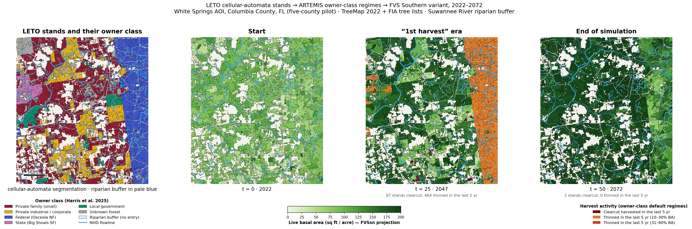

# LETO CA stands → ARTEMIS regimes → FVSsn: four-panel landscape figure

Reproduces the mockup figure — LETO-segmented stands with their owner class, then
projected basal area at t=0 / t=25 / t=50 with recent harvest activity — using real
data and the real methodology end to end:



## What is real here

- **AOI** — an ~13 × 15 km window around White Springs, FL (Columbia County, inside
  the five-county pilot), chosen by scanning the Harris ownership raster across the
  pilot for the window holding all four target owner classes (family, corporate,
  federal — the west edge of Osceola NF, state — Big Shoals State Forest) with the
  most perennial stream length (the Suwannee River crosses it). 216,972 cells on the
  TreeMap 2022 30 m grid (EPSG:5070), 160,730 of them forested (~35,700 acres).
- **Stand generation** — LETO's cellular-automata segmentation
  (`scripts/Cellular_automata/02_segment_treemap.py`, v3 boundary-vectorized),
  ported off ArcPy onto rasterio/scipy with the algorithm and its published
  parameters unchanged: 100-acre seeds, synchronous boundary-cell reassignment
  minimizing the weighted attribute cost (FORTYPCD .30 / STDAGE .25 / BALIVE .20 /
  QMD .15 / TPA .10, shared-edge bonus 0.1, z-clip 4), ownership hard boundaries,
  5-acre minimum / 300-acre maximum, similar-stand merge (≤10 yr age, same type),
  riparian split. LETO ships 40 iterations / 1% convergence; this run tightens
  that to 0.1% (cap 100), settling at iteration 40 with 0.096% of cells still
  moving → **4,279 parent stands → 6,944 management units** (1,523 riparian).
- **Riparian buffer** — EPA NHDPlus 2022 flowlines (`FL_5_Co_Streams.zip`) buffered
  by LETO's per-FCode first-pass rules (perennial 75 ft, intermittent/unclassified
  35 ft; the 55800 artificial-path channel of the Suwannee at the perennial
  distance). Riparian units take the absolute `no_management` override from
  `config/management_regimes.yaml` — grown, never entered.
- **Initial forest state** — TreeMap 2022 (RDS-2025-0032) imputed plot raster; the
  segmentation attributes come from its VAT (FORTYPCD, BALIVE, QMD, TPA_LIVE) plus
  STDAGE from the FIA COND dominant condition. Each unit's FVS tree list is the
  area-weighted union of its TreeMap donor plots' FVS-ready records
  (`FVS_TREEINIT_PLOT`, TREE_COUNT scaled by pixel share, donors <5% dropped and
  renormalised — `pipeline/s4_fvs/build_fvs_inputs.py`, LETO stage 4), from
  `Lowe_TreeMap_Chaz/output/FIA_5county_consolidated.db` — the FVS-ready SQLite the
  provenance scripts (`Lowe_TreeMap_Chaz/scripts/01–07`) built for every FIA plot
  TreeMap 2022 references in the pilot. 237 donor plots occur in this AOI.
  INV_YEAR is set to 2022, the TreeMap imputation anchor
  (`notes/treemap-fvs-workflow.md`).
- **Growth model** — the real FVS Southern (SN) variant, compiled from the USDA
  `ForestVegetationSimulator` sources (gfortran, `bin/CMakeLists.txt` with the
  NVEL submodule) in this container; runs are keyfile-driven with SQLite DB input
  and `FVS_Summary2` output. All 6,944 management units were runnable and were projected
  2022→2072 in ten 5-year cycles (zero failed runs).
- **Harvest activities** — the deterministic owner-class **default** prescriptions
  from `config/management_regimes.yaml`, resolved by
  `pipeline/s3_management/regime_assignment.assign_prescription` (age-based entry
  years snapped to cycles, pine/hardwood/other branching, riparian absolute
  override) and rendered by `pipeline/s4_fvs/regime_templates.render_keyfile`
  (verified ThinDBH and Estab/Plant/Natural keyword layouts; natural regeneration
  apportioned over the stand's own species by SDI share, the Diaz et al. 2015 rule).

## What is estimated (and why)

The simulated-annealing trajectory scheduler is not built yet (README "Known
constraints"), so no volume/even-flow/adjacency constraints select among the
eligible menus — every unit simply runs its owner class's *default* regime:
industrial pine on the 25-yr pulpwood rotation (thin @15, clearcut @30, replant),
industrial hardwood on clearcut-and-natural-regen, family and unknown forest on a
single light thin, federal on light selection, state pine on restoration thinning.
That is exactly the repo's current deterministic assignment; the annealer would
re-time and re-choose entries against TPO caps, not change the machinery. Second
rotations after a within-horizon replant are not scheduled (the keyfile expresses
one rotation; the coupling loop that restarts rotations is future work).

One visible consequence: age-based scheduling front-loads the harvest. Median
stand age in the AOI is 32, above the 25–30 yr industrial rotation ages, so 527
of the 730 clearcuts land in the very first cycle (2027) — the age-overhang pulse
an even-flow constraint exists to spread. `outputs/harvest_by_year.csv` has the
full removal schedule and `outputs/ba_trajectory_by_owner.csv` the area-weighted
BA trajectories: industrial land drops from 83 to 23 sq ft/ac at the pulse and
regrows to 180 by 2072, federal land saw-tooths under decadal selection, and
unmanaged local land plateaus near 194.

## Harvest policies (`--policy` on 04/05/06)

The deterministic default exposed its own weakness: offset-based public
prescriptions treat every stand of a class in the same cycle years, so the
whole federal forest thinned at once. Until the simulated-annealing scheduler
exists to select per-stand schedules against a regional even-flow target,
two alternative policies (`policies.py`) spread entries per stand:

- **`random`** — at each 5-year cycle boundary an eligible stand harvests
  with probability 0.25; an entry locks the stand out for 10 years (no stand
  harvested more than once per decade). 30% of events are clearcuts (followed
  by regeneration — planted loblolly on pine types, SDI-apportioned natural
  regen otherwise), 70% proportional thins at a random 15–45% intensity.
  Seeded per stand via crc32, so schedules are reproducible and uncorrelated
  across stands — harvests scatter in space and time instead of pulsing.
  Mean ~2 entries per stand over the horizon; many stands see more than one
  clearcut or thinning.
- **`heuristic`** — three rules, printed on the figure itself:
  family/unknown = no entry (like riparian); industrial = one thin from
  below at stand age 10 (age from FIA STDAGE, re-established at 0 by each
  clearcut) plus a clearcut whenever projected live BA exceeds 100 sq ft/ac —
  a state-dependent trigger evaluated **iteratively against real FVSsn
  output** (run, find the first cycle year BA crosses 100, schedule the
  clearcut + replant + next age-10 thin, rerun, repeat until nothing
  triggers); everything else (federal/state/local) = random entries under the
  same 10-year lockout. Riparian stays absolute no-entry under every policy.

Outputs are suffixed per policy: `fvs_summary2_random.csv`,
`mu_schedules_heuristic.csv`, `leto_artemis_forest_viz_heuristic.png`, …

## Region: AOI vs. the full five-county pilot (`--region`)

Every script accepts `--region aoi` (default — the White Springs window this
README otherwise describes) or `--region full` — the true, contiguous
Baker/Columbia/Hamilton/Suwannee/Union extent (`common.PILOT_COUNTY_FIPS`;
1.82M acres, ~51x the AOI). `01_stage_aoi.py --region full` additionally
rasterizes a county-membership mask at the TreeMap grid (the five counties
are not a rectangle, so the staged raster's bounding box pulls in slivers of
neighbouring counties along the edges; `03_ca_segment.py` ANDs this mask into
its valid-cell mask so segmentation never crosses the pilot boundary). Full
region outputs get a `_full` filename component ahead of any policy suffix
(`mu_summary_full.csv`, `fvs_summary2_full_heuristic.csv`, …) and never
collide with the AOI's unsuffixed files — both regions can be built and
inspected independently.

Two things that only bite at full-region scale, both fixed in this pipeline
rather than worked around:

- **The riparian/parent-segment split and the parent-segment lookup were
  O(segments) or O(segments²) in two spots** (`03_ca_segment.py`): a
  per-unique-value `ndimage.label` loop to split each parent segment's
  riparian/upland pieces apart, and a `segment_categorical_mode` call used to
  look up each management unit's parent segment. Both were invisible at AOI
  scale (a few thousand segments) and prohibitive at full-region scale
  (155k+ parent segments) — the mode lookup alone tried to allocate a
  `(188k x 155k)` count table (218 GiB). Fixed to the bbox-based
  `split_disconnected_segments` (already used elsewhere in the same file)
  and a direct scatter lookup respectively — a parent segment is looked up,
  not voted on, since a management unit is by construction a spatially
  connected piece of exactly one parent segment. Both fixes were verified to
  reproduce the AOI's segmentation output byte-for-byte before being trusted
  at full-region scale.
- **FVS raw output (keyfiles + per-shard SQLite databases) does not fit on
  disk at ~200k stands** if left in place until every shard finishes, the
  way the AOI's few-thousand-stand batches could afford to. `04_fvs_run.py`
  processes each shard in bounded chunks (`CHUNK_STANDS`, default 800):
  after each chunk, FVS_Summary2 is flushed to the shard's growing CSV and
  the chunk's keyfiles + FVSOut.db are deleted before the next chunk starts.
  Peak disk usage is `O(workers x CHUNK_STANDS)` regardless of total stand
  count — validated at the AOI's full 6,944-stand scale against the
  previously-committed output (byte-identical harvest counts, zero
  duplicate summary rows) before trusting it unattended overnight.

## Pipeline

```
01_stage_aoi.py         R2 pulls + windowed /vsis3/ raster clips (TreeMap, ownership,
                        + county mask for --region full)
02_build_attributes.py  VAT parse + FIA COND STDAGE → 5 attribute rasters (LETO stage 1)
03_ca_segment.py        cellular-automata segmentation + riparian split (LETO stage 2)
policies.py             random / heuristic harvest-schedule generators
04_fvs_run.py           weighted FVS inputs, schedules, chunked disk-safe FVSsn runs
                        (--policy, --region, --limit for smoke-testing)
05_figure.py            the four-panel figure (--policy, --region)
06_hexbin_figure.py     hexbin (mean BA per ~1 km hex) over the 2072 map (--region)
```

Run in order with `uv run python experiments/2026-08-24_leto-ca-forest-viz/<script>`;
set `FVSSN_BIN` to a compiled FVSsn binary, or build one at `fvs/bin/FVSsn`
(matching the root `.gitignore`'s `fvs/bin/` exclusion) — compile the USDA
`ForestVegetationSimulator` sources' `sn` variant per "What is real here"
above. Intermediate data lands in `work/` (gitignored). QA summaries
(CSV/JSON) are committed under `outputs/`; the PNG figures are not, per the
repo convention that inputs and outputs aren't committed (root
`.gitignore`) — regenerate them locally with `05_figure.py` /
`06_hexbin_figure.py` after running the pipeline once.

## Figure reading notes

- Owner-class colors are anchored to the mockup (family red, industrial yellow,
  federal blue, state pink) and CVD-separation checked; unknown forest is the
  neutral gray by convention.
- Stand boundaries are vectorized polygon outlines (hairline dark gray), with a
  heavier black owner-class boundary on the ownership panel. The white linear
  corridors inside the forest are TreeMap's real non-forest pixels — roads and
  cleared rights-of-way — not a rendering artifact.
- Riparian management units are their own stands: pale-blue fill on the
  ownership panel to show the buffer, and on every BA panel their own projected
  basal area with a muted blue corridor outline — watch them stay dark
  (untouched, still growing) through the harvested matrix at t=25. The minor
  perennial stream network is drawn only on the first two panels so it does not
  cover that corridor growth; the Suwannee channel stays on all panels.
- BA panels use a single-hue green ramp, 0–180 sq ft/ac, painted from each unit's
  post-removal FVS_Summary2 basal area. Units whose donors carried no live trees
  (nonstocked) hold their TreeMap BALIVE.
- A north arrow and scale bar appear once, bottom-left of panel 1 — all four
  panels share the same extent, scale, and orientation. The arrow points to
  true north as computed from the actual EPSG:5070 Albers grid convergence at
  the AOI (via pyproj, not assumed to be "up"): at this longitude, ~8° east of
  the -96° central meridian, true north tilts a few degrees off the raster's
  vertical axis, which the arrow's slight lean reflects rather than approximates.
- Harvest overlay classes on t=25/t=50: BA removal fraction in the preceding
  5 years — ≥90% = clearcut, 31–90% = heavy thin, 10–30% = light thin.
