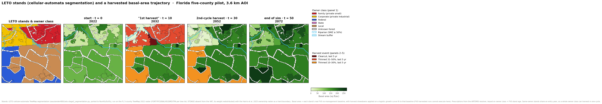

# LETO cellular-automata stands + harvested basal-area trajectory (demo)

A visualization requested ad hoc: show the **LETO stands created by the cellular-automata
segmentation** coloured by ownership class, then the **same stands over time with harvest
applied** (basal area per acre, with clearcut/thin events highlighted). Output:



Panel 1 is the LETO stands by owner class with the stream/riparian buffer; panels 2–5 are
the same stands at 2022 / 2032 / 2052 / 2072, coloured by basal area with harvest events
highlighted (clearcut = dark red, thin 31–50% = red, thin 10–30% = orange).

## What is real, and what is modelled

**Real:**
- **Stands** are produced by LETO's own cellular-automata algorithm — a faithful port of
  `aauslander480/Leto` `LETO_v1_project/leto/stage2_segmentation.py` to NumPy/SciPy, with
  arcpy removed (`leto_ca.py`). The mechanism is unchanged: block seeding split by
  ownership + connectivity → synchronous boundary-cell reassignment to the lowest-cost
  adjacent segment (weighted feature variance + forest-type penalty − shared-edge bonus,
  ownership a hard boundary) → split oversized / merge undersized / merge similar.
  Parameters are LETO's own `configs/maine_test.py` values.
- **Inputs:** the Florida five-county TreeMap 2022 raster (per-pixel tree-list features
  from the TreeMap VAT) and the Harris et al. 2025 ownership raster (RDS-2025-0045, read
  windowed through GDAL `/vsis3`; never downloaded whole).
- **Basal-area growth** is each stand's real FVS *no-management* baseline
  (`fvs_trajectory.csv`), and each stand's **prescription** and **stand age** come from the
  ARTEMIS repo's own resolver (`pipeline.s3_management.regime_assignment`) and FVS baseline.

**Modelled / simplified (documented, not fabricated):**
- **STDAGE is not in the TreeMap VAT**, so the CA runs on FORTYPCD/BALIVE/QMD/TPA with
  STDAGE's 0.25 weight redistributed proportionally across the other four.
- **Harvested trajectories are not re-simulated in FVS** (FVS is a Windows DLL and cannot
  run in the build environment). The harvest drawdown at each scheduled event is applied on
  top of a logistic growth curve fit to the stand's two real FVS baseline endpoints
  (current BA, mature BA). It is an illustration of the schedule, not an FVS harvested run.
- **Harvests are synchronized within an owner class** (same-owner stands share an entry
  year), so a whole owner class can harvest in one cycle. The simulated-annealing scheduler
  that would stagger these under flow/adjacency constraints is not built yet — so the
  snapshots are placed on the years where harvest actually occurs (2032, 2052) rather than
  an even 25/50-year split.

## Files

| File | What it is |
|---|---|
| `leto_ca.py` | LETO cellular-automata segmentation, ported to NumPy/SciPy (no arcpy). |
| `prep_aoi.py` | Warps the Harris ownership raster onto the TreeMap grid (cached) and scores AOI windows (mixed ownership + a stream + high real-owner coverage). Writes `aoi.json`. |
| `make_leto_figure.py` | Crops to the AOI, runs the CA, vectorises + attributes stands, assigns prescriptions/trajectories, and renders the five-panel figure. |
| `aoi.json` | The chosen AOI window (row/col offset + size, in TreeMap pixels). |
| `outputs/leto_stands_timeseries.png` | The figure. |

## Regenerate

```bash
# stage the inputs the scripts read (all under gitignored data/):
rclone copy r2:artemis-r2/data/Lowe_TreeMap_Chaz/FiveFloridaCounties/ data/interim/treemap5co/ \
  --include "TreeMap2022_CONUS_5FlCntys.tif" --include "TreeMap2022_CONUS_5FlCntys.tif.vat.dbf"
rclone copy r2:artemis-r2/data/Artemis_data/interim/management_units_pilot/ \
  data/interim/management_units_pilot/ --include "streams_5070.gpkg" --include "pilot_aoi.gpkg"
rclone copy r2:artemis-r2/data/Artemis_project_fvs_copy_no_management/fvs_trajectory.csv \
  data/interim/no_management_fl5co_fvs_output/

uv run python research/leto_ca_demo/prep_aoi.py          # ownership warp + AOI scan (writes aoi.json)
uv run python research/leto_ca_demo/make_leto_figure.py  # runs the CA and renders the figure
```

The ownership warp is cached to `own_aoi_full.npy` (≈32 MB, gitignored — delete to force a
re-warp). The Harris ownership raster is read through `/vsis3`, never downloaded.
